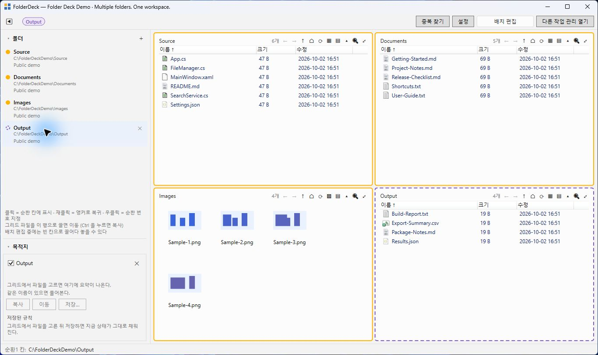

# Folder Deck

여러 폴더를 한 화면에서 관리하는 Windows WPF 데스크톱 앱입니다. 폴더를 작업 공간으로 묶고, 상시 타일과 순환 타일을 배치해 창 전환 없이 탐색·복사·이동할 수 있습니다.

현재 버전: **1.7.0** · 대상: **Windows x64** · **C# / .NET 10 / WPF**

## 주요 기능

- 작업 공간별 폴더 등록과 4×4 타일 배치·확장
- 목록·상세·큰 아이콘·아주 큰 아이콘 보기, 정렬과 미리보기
- 클립보드 및 끌어놓기 복사·이동, 휴지통 삭제
- 여러 목적지로 복사하는 대상함과 반복 작업 매크로
- 폴더 검색 및 Everything 연동 전역 검색
- 타일 목록 비교, 텍스트 내용 비교, 중복 후보 찾기, 배치 리네임

## 다운로드와 설치

- [최신 Release](https://github.com/nothing2that-sys/folder-deck/releases/latest)
- [FolderDeck-Setup.exe 다운로드](https://github.com/nothing2that-sys/folder-deck/releases/download/v1.7.0/FolderDeck-Setup.exe)
- [25초 데모 영상](https://github.com/nothing2that-sys/folder-deck/releases/download/v1.7.0/FolderDeck-Demo.mp4)

1. Release에서 `FolderDeck-Setup.exe`를 내려받아 실행합니다.
2. 설치를 완료하고 시작 메뉴의 **Folder Deck**를 실행합니다.
3. **＋ 새 작업 공간**에서 제목과 사용할 폴더를 등록합니다.

Windows x64용 자체 포함 배포본으로 .NET 런타임을 별도로 설치하지 않아도 됩니다. 현재 사용자 계정에 설치하며 사용자 설정과 작업 공간은 `%APPDATA%\FolderDeck`에 저장합니다. 기존 버전이 실행 중이면 창을 종료한 뒤 설치하세요.

설치본은 현재 코드 서명되지 않았습니다. 아래 SHA256 또는 Release의 `SHA256SUMS.txt`로 다운로드한 파일을 확인할 수 있습니다.

```powershell
Get-FileHash .\FolderDeck-Setup.exe -Algorithm SHA256
```

v1.7.0 설치본 SHA256:

```text
AD848E736BC72E4B60E9F0027A12D98576E3B34CA7D57E66C3B5D9E85A4393D3
```

## 실제 앱 화면



예제 파일만 사용한 실제 앱 화면입니다. 데모 영상에서는 파일 선택·대상함 복사·아이콘 보기 전환·타일 확장을 보여줍니다.

## 사용 안내

[사용자 매뉴얼](doc/USER_MANUAL.md)을 확인하세요. 브라우저에서 읽거나 인쇄하려면 `doc/FolderDeck_사용자_매뉴얼.html`을 내려받아 열면 됩니다. 외부 이미지나 인터넷 연결 없이 읽을 수 있습니다.

설치 파일은 위의 GitHub Release에서 받을 수 있습니다. 소스만 받은 경우 아래 명령으로 빌드하거나 설치 파일을 만들 수 있습니다.

## 개발 환경과 빌드

Windows에서 .NET SDK 10.0.204 이상을 준비합니다. 허용 SDK 범위는 `global.json`을 따릅니다. 처음 복원할 때 NuGet 연결이 필요합니다.

```powershell
dotnet restore FolderDeck.slnx
dotnet build FolderDeck.slnx -c Release --no-restore
dotnet test FolderDeck.slnx -c Release --no-build --no-restore
dotnet run --project src/FolderDeck.App/FolderDeck.App.csproj
```

셸·WPF 관련 테스트는 Windows가 필요하며 설치된 셸 확장이나 Preview Handler 등에 영향을 받을 수 있습니다. 자동 테스트는 실제 화면 조작 검증과 구분해야 합니다.

## 설치 파일 만들기

```powershell
dotnet publish src/FolderDeck.App/FolderDeck.App.csproj -c Release -r win-x64 --self-contained true -p:PublishSingleFile=false -p:DebugType=none -o artifacts/publish/win-x64
```

그다음 Inno Setup의 `ISCC.exe`로 컴파일합니다. Inno Setup이 PATH에 있어야 합니다.

```powershell
ISCC.exe installer/FolderDeck.iss
```

결과는 `artifacts/installer/FolderDeck-Setup.exe`입니다. 버전을 바꿀 때 `Directory.Build.props`와 `installer/FolderDeck.iss`의 `AppVersion`을 함께 갱신합니다.

## 검색과 데이터

Everything 전역 검색에는 Everything 프로그램을 별도로 설치하고 실행해야 합니다. 포함된 `Everything64.dll`은 연동용이며 검색 인덱스를 만들지 않습니다. Everything 없이도 일반 폴더 검색은 사용할 수 있습니다.

사용자 설정과 작업 공간은 `%APPDATA%\FolderDeck`에 저장됩니다. 여기에 실제 폴더 경로가 들어가므로 공개 저장소에 추가하지 마세요. `samples/workspaces`에는 가상 경로를 사용한 예제만 있습니다. 이 샘플은 이전 저장 형식의 로드 예제이며 경로는 자신의 환경에 맞게 바꿔야 합니다.

## 비교 기능의 범위

타일의 **같음** 배지는 파일의 이름·크기·수정 시각이 같다는 뜻이며 내용 일치를 보장하지 않습니다. 중복 찾기는 이름·크기가 같은 후보를 찾습니다. 내용 비교는 최대 5MB의 텍스트 파일을 지원합니다.

## 구성

- `src/FolderDeck.App`: WPF UI, Windows 셸 연동
- `src/FolderDeck.Core`: 모델, 저장, 열거, 파일 작업, 비교, 이름 변경
- `tests`: Core 및 App 테스트
- `samples`: 익명화된 작업 공간 예제
- `installer`: 사용자 계정용 설치 스크립트
- `doc`: 사용자 매뉴얼

## 외부 구성 요소와 라이선스

Everything SDK의 라이선스와 고지는 [THIRD-PARTY-NOTICES.txt](src/FolderDeck.App/Native/THIRD-PARTY-NOTICES.txt)에 포함되어 있습니다. NuGet 의존성은 각 프로젝트의 `PackageReference`에서 확인할 수 있으며 각 패키지의 라이선스가 적용됩니다.

Folder Deck는 [MIT License](LICENSE)로 배포합니다. 저작권 및 라이선스 고지를 유지하면 사용·수정·재배포·상업적 사용이 가능합니다. 외부 구성 요소에는 각자의 라이선스가 적용됩니다.